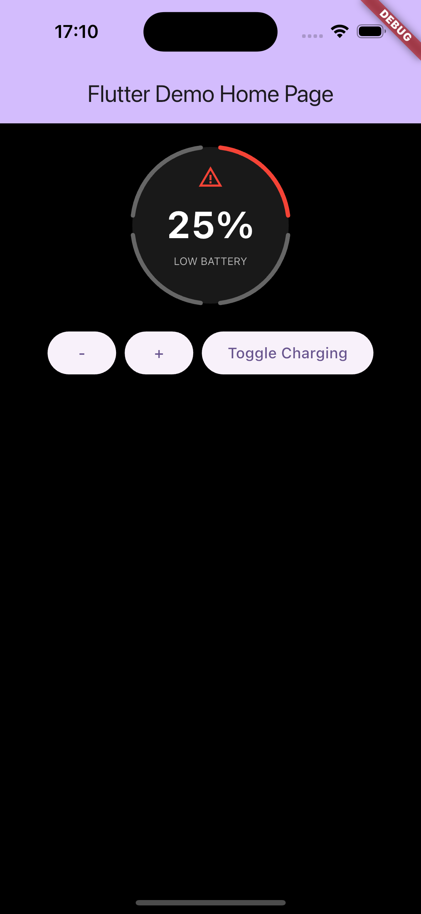
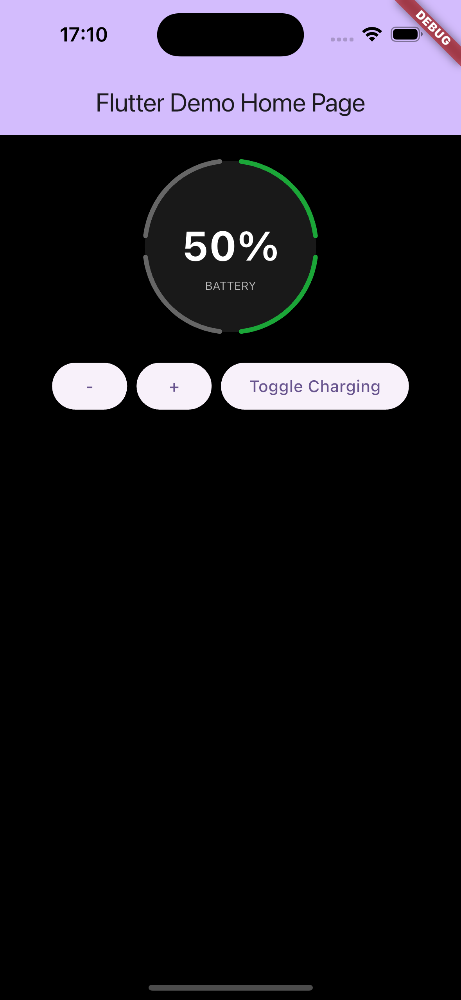
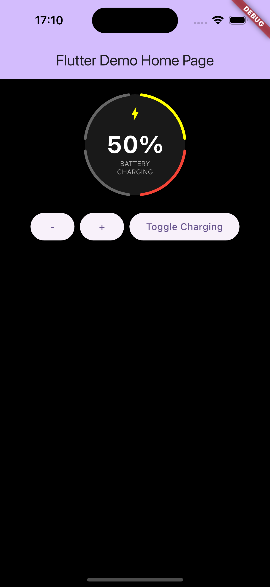

# Circular Battery Gauge

A simple Flutter demo showcasing a circular battery gauge with charging mode.

## Features

- Displays battery level in 4 segments  
- Visual indication when charging is active  
- Warning indicator for low battery levels  
- Built using `CustomPainter` for the gauge design
- Charging Segment Animation 

## Screenshots

<p align="center">
  
  
  
</p>

## Getting Started

To run this project:

1. Clone the repo:
   ```bash
   git clone https://github.com/your-username/circular_battery_gauge.git
   cd circular_battery_gauge
   ```

2. Install dependencies:
   ```bash
   flutter pub get
   ```

3. Run the app:
   ```bash
   flutter run
   ```

## About

This project was created as a simple demo of a battery indicator using Flutter. It serves as a base for visual components involving battery status or circular gauges.
